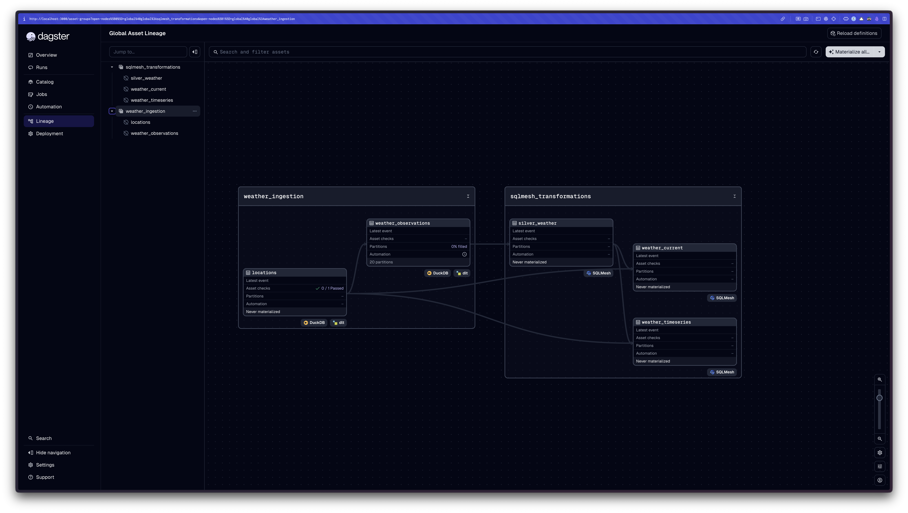
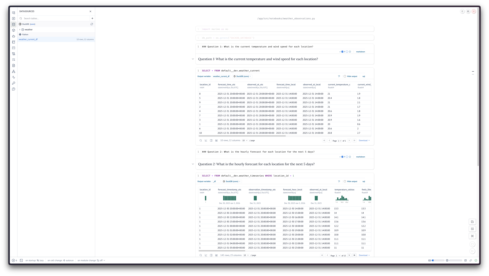
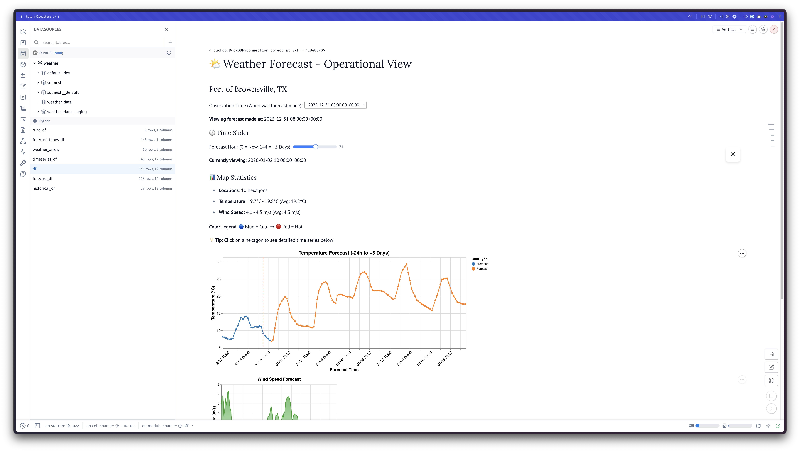

# Weather Data Pipeline - Amperon Take-Home Assignment

> **A production-grade weather forecasting pipeline built with DLT, Dagster, SQLMesh, DuckDB and Marimo**

## Introduction

This project implements a **real-time weather data pipeline** that ingests hourly forecasts from the Tomorrow.io API, transforms them into analytical models, and visualizes them through an interactive dashboard. The pipeline demonstrates modern data engineering practices including:

- **Incremental data loading** with idempotency guarantees
- **Bitemporal data modeling** for forecast accuracy analysis
- **Declarative data transformations** with SQLMesh
- **Automated scheduling** with Dagster
- **Interactive GPU-accelerated visualization** using Marimo and Lonboard

### What It Solves

**Business Problem**: Organizations need **reliable, automated weather forecasting** to:
- Monitor operational conditions at multiple locations
- Track forecast accuracy over time
- Make data-driven decisions based on weather predictions
- Analyze historical forecast performance

**Technical Solution**: This pipeline provides:
1. **Automated hourly ingestion** of weather forecasts from Tomorrow.io API
2. **Bitemporal storage** preserving both forecast time and observation time
3. **Sliding 144-hour window** (24h historical + 120h forecast) for operational view
4. **Data quality audits** ensuring completeness and validity
5. **Interactive visualization** for real-time monitoring


## Architecture

### High-Level Overview

```
┌─────────────────┐
│  Tomorrow.io    │
│   Weather API   │
└────────┬────────┘
         │ HTTP/JSON (hourly)
         ↓
┌────────────────────────────────────────────────────┐
│                  INGESTION LAYER                   │
│  ┌──────────────────────────────────────────────┐  │
│  │ DLT (Data Load Tool)                         │  │
│  │ - API Client with retry logic                │  │
│  │ - Schema evolution & type inference          │  │
│  │ - Incremental loading with deduplication     │  │
│  └──────────────────┬───────────────────────────┘  │
│                     │                              │
│  ┌──────────────────▼───────────────────────────┐  │
│  │ Dagster (Orchestration)                      │  │
│  │ - Hourly schedule (cron: 0 * * * *)          │  │
│  │ - Partition management (UTC hourly)          │  │
│  │ - Asset dependency tracking                  │  │
│  │ - Retry policies & error handling            │  │
│  └──────────────────┬───────────────────────────┘  │
└────────────────────┬┴──────────────────────────────┘
                     │
         ┌───────────▼──────────┐
         │   DuckDB (Storage)   │
         │  weather_data schema │
         │  - locations (10)    │
         │  - observations (∞)  │
         └───────────┬──────────┘
                     │
┌────────────────────▼───────────────────────────────┐
│              TRANSFORMATION LAYER                  │
│  ┌──────────────────────────────────────────────┐  │
│  │ SQLMesh (Declarative Transformations)        │  │
│  │                                              │  │
│  │ Silver Layer (Cleaning):                     │  │
│  │  └─ silver_weather                           │  │
│  │      - Data quality flags                    │  │
│  │      - Type casting & normalization          │  │
│  │      - Bitemporal preservation               │  │
│  │                                              │  │
│  │ Mart Layer (Business Logic):                 │  │
│  │  ├─ weather_current (SNAPSHOT)               │  │
│  │  │   - 1 row per location (10 total)         │  │
│  │  │   - Nowcast (T+0 forecast)                │  │
│  │  │   - INCREMENTAL_BY_UNIQUE_KEY             │  │
│  │  │                                           │  │
│  │  └─ weather_timeseries (SLIDING WINDOW)      │  │
│  │      - 144 rows per location (1,440 total)   │  │
│  │      - 24h historical + 120h forecast        │  │
│  │      - FULL refresh strategy                 │  │
│  │                                              │  │
│  │ Data Quality (Audits):                       │  │
│  │  - Location completeness (10 locations)      │  │
│  │  - Row count validation (144 per location)   │  │
│  │  - NOT NULL checks on critical fields        │  │
│  │  - Unique key constraints                    │  │
│  └──────────────────────────────────────────────┘  │
└────────────────────┬───────────────────────────────┘
                     │
         ┌───────────▼──────────┐
         │   DuckDB (Marts)     │
         │  default schema      │
         │  - weather_current   │
         │  - weather_timeseries│
         └───────────┬──────────┘
                     │
┌────────────────────▼────────────────────────────────┐
│              VISUALIZATION LAYER                    │
│  ┌──────────────────────────────────────────────┐   │
│  │ Marimo (Interactive Dashboard)               │   │
│  │ - H3 hexagon map (GPU-accelerated)           │   │
│  │ - Time slider (144-hour window)              │   │
│  │ - Temperature & wind charts                  │   │
│  │ - Location drill-down                        │   │
│  └──────────────────────────────────────────────┘   │
└─────────────────────────────────────────────────────┘
```


## Tech Stack

### 1. DLT (Data Load Tool) - Ingestion

**Purpose**: Extract weather data from Tomorrow.io API and load into DuckDB. Each run creates new snapshot with `observation_timestamp`

**Why DLT?**
- ✅ **Schema evolution**: Automatic schema detection and migration
- ✅ **Incremental loading**: Built-in deduplication using `_dlt_id`
- ✅ **Type inference**: Handles nested JSON automatically
- ✅ **Metadata tracking**: `_dlt_load_id`, `_dlt_load_time` for auditability
- ✅ **Retry logic**: Configurable retry policies for API failures

**Output Schema**:
- `weather_data.locations`: Static location master (10 rows)
- `weather_data.weather_observations`: Bitemporal fact table (append-only)


### 2. Dagster - Orchestration

**Purpose**: Schedule, monitor, and coordinate pipeline execution.

**Why Dagster?**
- ✅ **Asset-oriented**: Treats data as first-class citizen
- ✅ **Partition management**: Hourly partitions with automatic backfill
- ✅ **Dependency tracking**: Automatically resolves asset dependencies
- ✅ **Observability**: Built-in logging, metrics, and lineage
- ✅ **Type safety**: Python-native with type hints


### 3. SQLMesh - Transformations

**Purpose**: Declarative SQL transformations with incremental processing.

**Why SQLMesh?**
- ✅ **Declarative**: Models defined in SQL, not code
- ✅ **Incremental strategies**: `FULL`, `INCREMENTAL_BY_TIME_RANGE`, `INCREMENTAL_BY_UNIQUE_KEY`
- ✅ **Virtual environments**: Test changes without affecting production
- ✅ **Built-in audits**: Data quality checks as first-class citizens
- ✅ **Version control**: Change detection and automatic migration

**Model Strategies**:

| Model | Strategy | Rationale |
|-------|----------|-----------|
| `silver_weather` | `INCREMENTAL_BY_TIME_RANGE` | Append-only fact table, partitioned by observation_timestamp |
| `weather_current` | `INCREMENTAL_BY_UNIQUE_KEY` | Snapshot (1 row per location), upsert by location_id |
| `weather_timeseries` | `FULL` | Sliding window (144h), rebuilt hourly to ensure freshness |


### 4. DuckDB - Storage & Analytics

**Purpose**: Embedded OLAP database for fast analytical queries.

**Why DuckDB?**
- ✅ **Embedded**: No separate server, runs in-process
- ✅ **Fast**: Columnar storage, vectorized execution
- ✅ **SQL compliance**: Full SQL:2016 support
- ✅ **Extensions**: H3 (geospatial), AWS (S3), httpfs
- ✅ **Simplicity**: Single-file database, easy backup/restore


**Current DuckDB Performance** (back-of-envelope):
- **Data volume**: 10 locations × 145h/run × 24 runs/day = 34,800 rows/day
- **Monthly**: ~1M rows/month (~50MB uncompressed)
- **Yearly**: ~12M rows/year (~600MB)
- **DuckDB limit**: Easily handles 100M+ rows in single file


- **Production Considerations**:
  - **TimescaleDB** (PostgreSQL extension for time-series)
    - Better write performance at scale (1M+ rows/sec)
    - Automatic partitioning and compression
    - Continuous aggregates for real-time metrics
  - **ClickHouse** (columnar OLAP database)
    - Extreme query performance (billions of rows)
    - Distributed architecture for horizontal scaling
    - Real-time data ingestion


## Data Model

### Bronze Layer (DLT Output)

#### `weather_data.locations`
**Purpose**: Location master table (static).

| Column | Type | Description |
|--------|------|-------------|
| `id` | BIGINT | Primary key (1-10) |
| `name` | VARCHAR | Location name (e.g., "Port of Brownsville") |
| `lat` | DOUBLE | Latitude |
| `lon` | DOUBLE | Longitude |
| `timezone` | VARCHAR | IANA timezone (e.g., "America/Chicago") |

**Grain**: `id`
**Idempotency**: MERGE write disposition (upsert on id)
**Cardinality**: 10 rows (static)


#### `weather_data.weather_observations`
**Purpose**: Bitemporal fact table storing all forecast snapshots.

| Column | Type | Description |
|--------|------|-------------|
| `_dlt_id` | VARCHAR | DLT-generated unique identifier |
| `_dlt_load_id` | DOUBLE | DLT load timestamp (unix epoch) |
| `_locations_id` | BIGINT | Foreign key to locations.id |
| `start_time` | TIMESTAMP | **Forecast timestamp** (when weather occurs) |
| `observation_timestamp` | TIMESTAMP | **Observation timestamp** (when forecast was made) |
| `values__temperature` | DOUBLE | Temperature (°C) |
| `values__wind_speed` | DOUBLE | Wind speed (m/s) |
| `values__humidity` | BIGINT | Humidity (%) |
| ... | ... | 15+ weather metrics |

**Grain**: `(_dlt_id)` or `(_locations_id, start_time, observation_timestamp)`
**Idempotency**: APPEND write disposition (every run creates new rows)
**Cardinality**: ~1,450 rows per hourly run (10 locations × 145 hours)

**Bitemporal Dimensions**:
1. **`start_time`** (Forecast Timestamp): WHEN the weather event occurs
2. **`observation_timestamp`** (Observation Timestamp): WHEN we made the forecast

**Example Data**:
```
observation_timestamp    start_time              temperature
2025-12-30 16:00:00     2025-12-30 16:00:00     11.4°C  ← Nowcast
2025-12-30 16:00:00     2025-12-30 17:00:00     12.6°C  ← +1h forecast
2025-12-30 16:00:00     2025-12-31 16:00:00     15.2°C  ← +24h forecast
```


### Silver Layer (SQLMesh Cleaning)

#### `silver_weather`
**Purpose**: Cleaned, normalized weather observations with data quality flags.

**Transformations**:
- Type casting and normalization
- Data quality flags (`has_invalid_temperature`, `has_invalid_wind`)
- Derived fields (`precipitation_type_label`)
- DLT metadata preservation

**Grain**: `(location_id, forecast_timestamp_utc, observation_timestamp_utc)`
**Idempotency**: `INCREMENTAL_BY_TIME_RANGE` (partitioned by observation_timestamp_utc)
**Cardinality**: Same as bronze (~1,450 rows per hour, append-only)

**Key Columns**:
- `location_id` (normalized from `_locations_id`)
- `forecast_timestamp_utc` (renamed from `start_time`)
- `observation_timestamp_utc` (preserved)
- `temperature_celsius`, `wind_speed_mps` (cleaned)
- `has_invalid_temperature`, `has_invalid_wind` (quality flags)


### Mart Layer (SQLMesh Business Logic)

#### `weather_current`
**Purpose**: Snapshot of **current conditions** (nowcast) per location.

**Answers**: *"What is the current temperature and wind speed for each location?"*


**Query Logic**:
```sql
-- Get latest observation timestamp
WITH latest_observation AS (
  SELECT MAX(observation_timestamp_utc) FROM silver_weather
)

-- Filter to nowcast (forecast_timestamp = observation_timestamp)
SELECT * FROM silver_weather
WHERE observation_timestamp_utc = latest_observation.latest_obs_time
  AND forecast_timestamp_utc = observation_timestamp_utc  -- Nowcast!
```

**Grain**: `location_id`
**Idempotency**: `INCREMENTAL_BY_UNIQUE_KEY` (upsert on location_id)
**Cardinality**: **10 rows** (1 per location)
**Refresh**: Every hour (replaces existing rows)


#### `weather_timeseries`
**Purpose**: **Sliding 144-hour window** of forecasts per location.

**Answers**: *"What is the hourly forecast for each location for the next 5 days?"*


**Query Logic**:
```sql
-- Get latest observation only
WITH latest_observation AS (
  SELECT MAX(observation_timestamp_utc) FROM silver_weather
)

-- Return all 144 forecast hours for latest observation
SELECT * FROM silver_weather
WHERE observation_timestamp_utc = latest_observation.latest_obs_time
ORDER BY location_id, forecast_timestamp_utc
```

**Grain**: `(location_id, forecast_timestamp_utc)`
**Idempotency**: `FULL` refresh (rebuilds entire table every hour)
**Cardinality**: **1,440 rows** (10 locations × 144 hours)
**Refresh**: Every hour (complete rebuild)

**Window Composition**:
- **24 hours historical** (backcasted observations)
- **120 hours forecast** (5 days forward)
- **Total: 144 hours** per location


## Installation

### Prerequisites

- Docker & Docker Compose
- [Tomorrow.io API Key](https://app.tomorrow.io/development/keys) (sign up for free account)

### Setup

#### 1. Configure Environment

Create a `.env` file in the project root with your Tomorrow.io API key:

```bash
# Create .env file in project root
cd workspace/dg-workspace && cat > .env << EOF
SOURCES__TOMORROW_IO_PIPELINE__TOMORROW_IO_ACCESS_TOKEN=your_api_key_here
EOF
```

> **Note**: .env.example - replace `your_api_key_here` with your actual Tomorrow.io API key from https://app.tomorrow.io/development/keys

#### 2. Start Services

```bash
# Build and start Dagster container
docker-compose up -d
```

#### 3. Access Dagster UI

Open http://localhost:3000 in your browser.

You should see the Dagster web interface with the asset catalog and lineage graph.

#### 4. Materialize Assets

**Option A: Via Web UI (Recommended)**

The web UI provides immediate visual feedback and shows execution progress in real-time.

1. Navigate to **Assets** → **View all assets**
2. Click **Materialize all** button
3. In the materialization dialog:
   - Select **Latest** partition (materializes most recent hourly data)
   - Click **Materialize**
4. Watch the run progress in real-time (green = success, red = failure)
5. Wait for all assets to show green checkmarks (~2-3 minutes for initial run)

**Option B: Via CLI**

```bash
# Materialize all assets (latest partition)
docker-compose exec dagster dagster asset materialize \
  -m dg_amperon.definitions \
  --select '*'
```

#### 5. View Interactive Visualization

Once assets are materialized, explore the interactive weather dashboard:

```bash
# Start Marimo dashboard (interactive map + charts)
docker exec -it amperon-dagster-1 \
  marimo edit \
  --host 0.0.0.0 \
  --port 8000 \
  --no-token \
  --no-skew-protection \
  /app/src/notebooks/weather_viz.py
```

Open http://localhost:8000 to see the GPU-accelerated H3 hexagon map with time slider.


### Data Persistence

The `./data` directory contains all persistent state:
- `weather.db`: DuckDB database with all weather data
- `dagster_home/`: Dagster run history and metadata
- `dlt/`: DLT pipeline state and schema evolution tracking

**Stopping and restarting containers preserves all data**:
```bash
docker-compose down  # Stop containers (data persists)
docker-compose up -d # Restart containers (data still available)
```

**To reset and start fresh**:
```bash
docker-compose down
rm -rf data/        # ⚠️ Deletes all data
docker-compose up -d
```

## Usage

### Asset Lineage Graph

The Dagster UI provides a visual representation of the data pipeline dependencies:




To backfill or re-process a specific hourly partition use the Dagster UI:

1. Navigate to **Assets** → **weather_data/weather_observations**
2. Click **Partitions** tab
3. Select specific partition from grid
4. Click **Materialize**


#### Query Data Directly in Notebooks

**Weather Observations Analysis** (`notebooks/weather_observations.py`):

Query and analyze weather data using Marimo's reactive notebook:

```bash
docker exec -it amperon-dagster-1 \
  marimo edit \
  --host 0.0.0.0 \
  --port 8000 \
  --no-token \
  /app/src/notebooks/weather_observations.py
```



**Interactive Map Visualization** (`notebooks/weather_viz.py`):

GPU-accelerated H3 hexagon map with time-based filtering:

```bash
docker exec -it amperon-dagster-1 \
  marimo edit \
  --host 0.0.0.0 \
  --port 8000 \
  --no-token \
  --no-skew-protection \
  /app/src/notebooks/weather_viz.py
```



**Features**:
- Time slider to explore 144-hour forecast window
- Interactive H3 hexagon grid visualization
- Temperature and wind speed overlays
- Location-specific drill-down

## Scaling

For detailed information on architectural considerations and strategies for scaling to 1,000+ locations, see [SCALING_STRATEGY.md](SCALING_STRATEGY.md).


## Monitoring & Observability

### Dagster UI

- **Asset lineage**: Visual dependency graph
- **Run history**: Success/failure tracking
- **Logs**: Structured logging per run
- **Sensors**: Future alerting on failures

### SQLMesh UI

- **Audit results**: Data quality check outcomes
- **Model diffs**: Change detection between runs
- **Execution plans**: Preview transformations before applying
- **Command**: `cd workspace/sqlmesh && sqlmesh ui`

### DLT Dashboard

- Get an overview of the pipeline state
- Inspect all schemas of your pipeline, including tables, child tables, and columns, along with all column hints
- Inspect the incremental state of each resource
- **Command**: `dlt dashboard`

### Metrics to Track
- **API latency**: Tomorrow.io response times
- **Row counts**: Expected vs. actual per run
- **Data freshness**: Time since last successful run
- **Audit failures**: Data quality violations

## Project Structure

```bash
amperon/
├── README.md                              ← This file (top-level overview)
├── ASSIGNMENT.md                          ← Original take-home instructions
├── docker-compose.yaml                    ← Multi-service orchestration
├── Dockerfile                             ← Dagster + dependencies image
├── data/
│   └── weather.db                         ← DuckDB database (gitignored)
├── workspace/
│   ├── dg-workspace/                      ← Dagster project
│   │   ├── README.md                      ← Dagster-specific docs
│   │   ├── src/dg_amperon/
│   │   │   ├── defs/
│   │   │   │   ├── weather_ingestion/
│   │   │   │   │   ├── assets.py          ← DLT assets (@dlt_assets)
│   │   │   │   │   ├── definitions.py     ← Jobs, schedules, resources
│   │   │   │   │   ├── tomorrow_io_pipeline.py ← DLT source implementation
│   │   │   │   │   └── resources.py       ← DuckDB resource config
│   │   │   │   └── sqlmesh/               ← SQLMesh assets
│   │   │   └── definitions.py             ← Root Dagster definitions
│   │   ├── tests/                         ← Unit & integration tests
│   │   ├── .env.example                   ← Environment variable template
│   │   └── pyproject.toml                 ← Python dependencies
│   └── sqlmesh/                           ← SQLMesh project
│       ├── config.yaml                    ← SQLMesh configuration
│       ├── models/
│       │   ├── silver/
│       │   │   └── silver_weather.sql     ← Silver layer
│       │   └── marts/
│       │       ├── weather_current.sql    ← Snapshot (10 rows)
│       │       └── weather_timeseries.sql ← Sliding window (1,440 rows)
│       └── audits/
│           ├── assert_all_locations_present.sql
│           ├── assert_timeseries_window_complete.sql
│           └── assert_unique_location_snapshot.sql
└── notebooks/
    └── weather_viz.py                     ← Marimo interactive dashboard
```

## Future Enhancements & Production Roadmap

> **MVP Note**: This project is currently configured as a local MVP. For production deployment, the Dagster control plane requires a dedicated persistent database (e.g., PostgreSQL) for run metadata and event logs.

1. **Alerting**: Slack/email notifications on pipeline failures via Dagster sensors.
2. **Data freshness sensors**: Auto-trigger downstream processing when upstream ingestion completes.
3. **Backfill automation**: Sensor-based gap detection and automated partition backfilling.
4. **Multi-region support**: Scale to 1,000+ locations globally.
5. **Forecast accuracy tracking**: Implement historical snapshotting to compare predictions against observed actuals.

---

**Built with ❤️ using Claude Code, DLT, Dagster, SQLMesh, DuckDB and Marimo**
