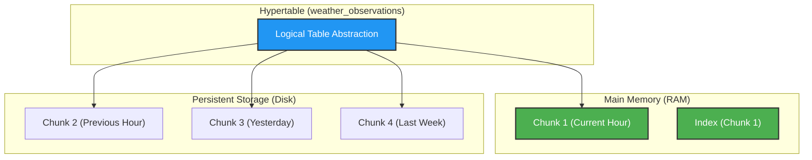

# Scaling Strategy: Weather Data Pipeline

> [!NOTE]
> This document provides a high-level architectural proposal for scaling the weather data pipeline from an MVP (10 locations) to a production-grade IoT network (thousands of locations) using **PostgreSQL with the TimescaleDB extension**.

## 1. Back-of-the-Envelope Calculations

To understand the requirements, we define our **Baseline Metrics**:
- **Row Size**: ~300 bytes (average)
- **Rows per Run (1 loc)**: 145 (24h backfill + 120h forecast + 1 current)
- **Frequency**: 24 runs/day (hourly)
- **Retention**: 5-10 years

### Data Profiles by Scale

| Locations | Rows/Hour | Rows/Day | Rows/Year | Extraction Volume (Raw/Day) |
|-----------|-----------|----------|-----------|----------------------------|
| **10** (MVP) | 1,450 | 34,800 | 12.7M | ~10 MB |
| **1,000** | 145,000 | 3.48M | 1.27B | ~1 GB |
| **10,000** | 1.45M | 34.8M | 12.7B | ~10 GB |
| **100,000** | 14.5M | 348M | 127B | ~100 GB |
| **1,000,000**| 145M | 3.48B | 1.27T | ~1 TB |

### Data Velocity and Loading Volume

| Scale | Avg. Velocity (Rows/Sec) | Peak Loading Vol (Batch/Hour) | Total Vol (At Rest - 5yr) |
|-------|--------------------------|------------------------------|--------------------------|
| 1,000 | ~40 | 145k | ~1.9 TB |
| 10,000 | ~400 | 1.45M | ~19 TB |
| 100,000 | ~4,000 | 14.5M | ~190 TB |

## 2. Impact on Source System

As we scale, the **Tomorrow.io API** becomes a critical dependency:

- **Load Tolerance**: At 10,000 locations, a naive implementation would make 10,000 POST requests every hour. We leverage **DLT (Data Load Tool)** to handle extraction concurrency, state management, and retry logic, ensuring we respect API rate limits while maximizing throughput.
- **Availability**: The pipeline must handle API downtime gracefully. We need a **backfill strategy** to fill gaps when the API is restored. Note that because TimescaleDB native compression prevents **UPSERT** operations on compressed chunks, we must define a compression policy that leaves a "warm" window (e.g., 7 days) of uncompressed data to accommodate late-arriving historical backfills before data is compressed and no longer accessible via **UPSERT**.
- **Distribution**: For 100k+ locations, extraction should be distributed across multiple regional bridge nodes to avoid a single egress bottleneck.

## 3. The Write Path: Ingesting Millions of Rows

To handle the transition from millions to billions of rows, the write path must evolve:

- **Batching**: DLT handles this natively by using the `COPY` protocol and batching inserts (5,000-10,000 rows). In PostgreSQL, the `COPY` command bypasses the transactional overhead of individual `INSERT` statements, typically processing between **100,000 and 500,000 rows per second** on modern hardware. This ensures high-throughput ingestion without the overhead of single-row transactions.

- **TimescaleDB Hypertables**: Automatically partition data by `observation_timestamp`. This ensures that indexes for the most recent data (the "hot" set) stay in memory, preventing performance degradation as the table grows to billions of rows.

- **Write Parallelism**: DLT handles bulk inserts efficiently by breaking down large datasets into manageable chunks and loading them into the destination. This approach allows for efficient processing and loading of data, especially when dealing with limited memory resources, while TimescaleDB handles concurrent writes to different partitions (chunks) very efficiently.

## 4. The Read Path: Querying Billions of Rows

- **Read Replicas**: Offload dashboard and analytical queries from the primary write node.
- **Indexing Strategy**:
    - **Primary Time Index**: In TimescaleDB, the `observation_timestamp` is the primary dimension for partitioning. Chunks are automatically indexed by time.
    - **Composite Operational Index**: For the "Region" use case, a composite index like `(region, observation_timestamp DESC)` is highly recommended. This allows the database to instantly filter by region and then jump to the most recent weather data within that region.
    - **B-Tree**: Best for selective lookups (e.g., "latest conditions for Port Brownsville 1").
    - **BRIN (Block Range Indexes)**: Used for deep historical scans on older chunks where B-Trees might become too large. This is ideal for "all temperatures in the last 2 years."

## 5. 5-10 Year Preservation Strategy

- **Native Compression**: TimescaleDB can compress old chunks by ~90% by converting row storage to columnar storage for older data.
- **Tiered Storage**: 

|**Tier**|**Duration**|**Storage Media**|**Technology**|**Access Speed**|
|---|---|---|---|---|
|**Hot**|0-3 Months|NVMe SSD|Standard Hypertable|Sub-second|
|**Warm**|3mo - 2yr|Standard SSD|Compressed Hypertable|1-5 Seconds|
|**Cold**|2-10+ years|AWS S3 / GCS|`parquet`|10+ Seconds|

## 6. Sharding & Multi-Node Criteria

Sharding becomes necessary when:
1.  **Ingestion Window Completion**: At massive scales (100k+ locations), even with the `COPY` protocol, the sheer volume of data per batch (14.5M+ rows) might take too long to process on a single node, risking overlap with the next hourly run.
2.  **Disk I/O Saturation**: Bulk loading millions of rows creates significant I/O spikes. Sharding distributes this I/O load across multiple independent disk controllers.
3.  **Storage Volume**: Exceeds ~20-50 TB (restoring or backing up a single node of this size becomes a multi-day operation).
4.  **Regional Latency**: IoT devices in EU should ideally write to an EU shard, and US devices to a US shard to minimize extraction latency and comply with data sovereignty.

## 7. Conclusion

Moving from DuckDB to TimescaleDB allows us to keep the familiarity of PostgreSQL while gaining specialized time-series features. For the 1,000 to 10,000 location range, a single well-tuned TimescaleDB node with 2-3 read replicas is the optimal production strategy. Beyond 100,000 locations, a transition to **Multi-node TimescaleDB** or a purely columnar store like **ClickHouse** should be evaluated.
