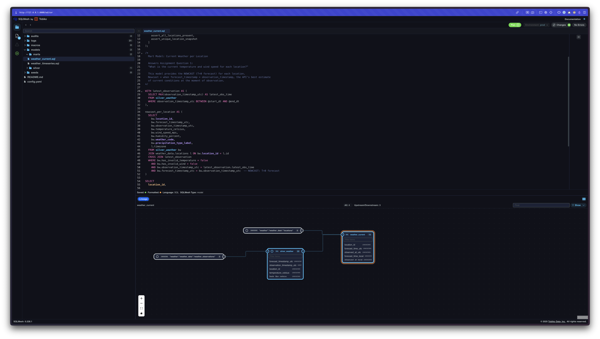

# SQLMesh Transformation Layer

> **Declarative SQL transformations with built-in data quality audits**

## Overview

This SQLMesh project transforms raw weather data from DLT into clean, business-ready analytical models. It implements a **medallion architecture** (Silver → Mart) with automated data quality checks to ensure reliability and accuracy.

### What This Layer Does

**Transforms**: Raw weather observations → Clean analytical marts  
**Ensures**: Data quality through declarative audits  
**Provides**: 
- **Nowcast snapshot**: Current conditions per location (10 rows)
- **Sliding 144h window**: Full forecast timeline (1,440 rows)

---

## Architecture

```
┌─────────────────────────────────────────────────┐
│         DuckDB: weather_data schema             │
│  (DLT Bronze - Source of Truth)                 │
│  - locations (10 static rows)                   │
│  - weather_observations (append-only, ∞ rows)   │
└──────────────────┬──────────────────────────────┘
                   │
         ┌─────────▼─────────┐
         │   SQLMesh Plan    │
         │  (Transformation) │
         └─────────┬─────────┘
                   │
┌──────────────────▼──────────────────────────────┐
│              SILVER LAYER                       │
│  ┌──────────────────────────────────────────┐  │
│  │  silver_weather                          │  │
│  │  - Cleans & normalizes raw data          │  │
│  │  - Adds quality flags                    │  │
│  │  - Preserves bitemporal dimensions       │  │
│  │  - INCREMENTAL_BY_TIME_RANGE             │  │
│  │  - Partitioned by observation_timestamp  │  │
│  └──────────────────────────────────────────┘  │
└──────────────────┬──────────────────────────────┘
                   │
┌──────────────────▼──────────────────────────────┐
│               MART LAYER                        │
│  ┌──────────────────────────────────────────┐  │
│  │  weather_current (Snapshot)              │  │
│  │  - 10 rows (1 per location)              │  │
│  │  - Nowcast (T+0 forecast)                │  │
│  │  - INCREMENTAL_BY_UNIQUE_KEY             │  │
│  │  - Answers: "Current temperature?"       │  │
│  └──────────────────────────────────────────┘  │
│                                                 │
│  ┌──────────────────────────────────────────┐  │
│  │  weather_timeseries (Sliding Window)     │  │
│  │  - 1,440 rows (144h × 10 locations)      │  │
│  │  - 24h historical + 120h forecast        │  │
│  │  - FULL refresh every hour               │  │
│  │  - Answers: "5-day hourly forecast?"     │  │
│  └──────────────────────────────────────────┘  │
└─────────────────────────────────────────────────┘
```

---

## Quick Start

### 1. Plan Changes (Dry Run)

```bash
cd workspace/sqlmesh
sqlmesh plan
```

**What it does**: Shows you what SQLMesh will change before applying.

### 2. Apply Changes

```bash
sqlmesh plan --auto-apply
```

**What it does**: Creates/updates models in production.

### 3. Run Transformations

```bash
sqlmesh run
```

**What it does**: Processes latest data through all models.

### 4. Launch SQLMesh UI

```bash
sqlmesh ui
```

**What it does**: Opens interactive web UI for exploring models, lineage, and audits.



---

## Model Catalog

### Silver Layer

#### `silver_weather`
**Purpose**: Clean, standardized weather observations with quality flags.

**Grain**: `(location_id, forecast_timestamp_utc, observation_timestamp_utc)`  
**Strategy**: `INCREMENTAL_BY_TIME_RANGE` (partitioned by observation_timestamp_utc)  
**Cardinality**: ~1,450 rows per hour (append-only)

**Transformations**:
- ✅ Normalize column names (`_locations_id` → `location_id`)
- ✅ Cast types (`DOUBLE`, `TIMESTAMP`, `VARCHAR`)
- ✅ Add quality flags (`has_invalid_temperature`, `has_invalid_wind`)
- ✅ Derive labels (`precipitation_type_label`: None/Rain/Snow/etc.)
- ✅ Preserve DLT metadata (`_dlt_id`, `_dlt_load_time`)

**Quality Checks**:
```sql
audits [
  ASSERT_NOT_NULL(column_name := location_id),
  ASSERT_NOT_NULL(column_name := forecast_timestamp_utc),
  ASSERT_NOT_NULL(column_name := observation_timestamp_utc),
  ASSERT_NOT_NULL(column_name := temperature_celsius),
  ASSERT_NOT_NULL(column_name := wind_speed_mps),
  ASSERT_UNIQUE_KEY(key_column := _dlt_id)
]
```

---

### Mart Layer

#### `weather_current`
**Purpose**: Snapshot of **nowcast** (current conditions) per location.

**Grain**: `location_id`  
**Strategy**: `INCREMENTAL_BY_UNIQUE_KEY` (upsert by location_id)  
**Cardinality**: **10 rows** (1 per location)  
**Refresh**: Every hour (replaces rows)

**Business Logic**:
```sql
-- Get latest observation timestamp
WITH latest_observation AS (
  SELECT MAX(observation_timestamp_utc) FROM silver_weather
)

-- Filter to nowcast (forecast_timestamp = observation_timestamp)
-- This is the API's "best estimate of current conditions"
SELECT * FROM silver_weather
WHERE observation_timestamp_utc = latest_observation.latest_obs_time
  AND forecast_timestamp_utc = observation_timestamp_utc  -- Nowcast!
```

**Key Columns**:
- `location_id` - Location identifier (1-10)
- `forecast_time_utc` - When conditions apply (equals observation time for nowcast)
- `observed_at_utc` - When forecast was made
- `current_temperature_c` - Temperature in Celsius
- `current_wind_speed_mps` - Wind speed in meters/second
- `current_wind_speed_kmh` - Wind speed in km/h (derived)
- `current_humidity_pct` - Humidity percentage
- `weather_code` - Tomorrow.io weather code
- `precipitation_type_label` - None/Rain/Snow/etc.

**Answers**: *"What is the current temperature and wind speed for each location?"*

**Quality Checks**:
```sql
audits [
  ASSERT_UNIQUE_KEY(key_column := location_id),
  ASSERT_NOT_NULL(column_name := current_temperature_c),
  ASSERT_NOT_NULL(column_name := current_wind_speed_mps),
  assert_all_locations_present,      -- Custom: ensures 10 locations
  assert_unique_location_snapshot    -- Custom: no duplicates per location
]
```

---

#### `weather_timeseries`
**Purpose**: **Sliding 144-hour window** of forecasts per location.

**Grain**: `(location_id, forecast_timestamp_utc)`  
**Strategy**: `FULL` (rebuild entire table every hour)  
**Cardinality**: **1,440 rows** (10 locations × 144 hours)  
**Refresh**: Every hour (complete rebuild)

**Window Composition**:
- **24 hours historical** (backcasted observations: T-24h to T+0h)
- **120 hours forecast** (future predictions: T+0h to T+120h)
- **Total: 144 hours** per location

**Business Logic**:
```sql
-- Get latest observation only
WITH latest_observation AS (
  SELECT MAX(observation_timestamp_utc) FROM silver_weather
)

-- Return all 144 forecast hours for latest observation
SELECT * FROM silver_weather
WHERE observation_timestamp_utc = latest_observation.latest_obs_time
ORDER BY location_id, forecast_timestamp_utc
```

**Key Columns**:
- `location_id` - Location identifier (1-10)
- `forecast_timestamp_utc` - When weather event occurs (UTC)
- `observation_timestamp_utc` - When forecast was made (UTC)
- `temperature_celsius` - Temperature in Celsius
- `feels_like_celsius` - Apparent temperature
- `wind_speed_mps` - Wind speed in m/s
- `wind_speed_kmh` - Wind speed in km/h (derived)
- `wind_direction_degrees` - Wind direction (0-360°)
- `wind_direction_cardinal` - N/NE/E/SE/S/SW/W/NW (derived)
- `precipitation_intensity_mmh` - Precipitation rate (mm/h)
- `precipitation_probability_percent` - Chance of precipitation
- `precipitation_type_label` - None/Rain/Snow/etc.
- `humidity_percent` - Humidity
- `cloud_cover_percent` - Cloud coverage
- `pressure_hpa` - Atmospheric pressure
- `visibility_km` - Visibility
- `data_type` - 'Historical' or 'Forecast' (derived)

**Answers**: *"What is the hourly forecast for each location for the next 5 days?"*

**Quality Checks**:
```sql
audits [
  ASSERT_NOT_NULL(column_name := location_id),
  ASSERT_NOT_NULL(column_name := forecast_timestamp_utc),
  ASSERT_NOT_NULL(column_name := temperature_celsius),
  ASSERT_NOT_NULL(column_name := wind_speed_mps),
  assert_all_locations_present,          -- 10 locations required
  assert_timeseries_window_complete      -- 144 rows per location (±10 tolerance)
]
```

---

## Data Quality Audits

SQLMesh enforces data quality through **declarative audits** that run automatically during `sqlmesh plan` and `sqlmesh run`.

### Built-in Audits

#### `ASSERT_NOT_NULL`
**Purpose**: Ensures critical columns have no NULL values.

**Example**:
```sql
ASSERT_NOT_NULL(column_name := temperature_celsius)
```

**When it fails**: Pipeline blocks if NULLs found in specified column.

---

#### `ASSERT_UNIQUE_KEY`
**Purpose**: Validates column(s) uniquely identify each row.

**Example**:
```sql
ASSERT_UNIQUE_KEY(key_column := location_id)
```

**When it fails**: Pipeline blocks if duplicate keys found.

---

### Custom Audits

#### `assert_all_locations_present`
**File**: `audits/assert_all_locations_present.sql`  
**Applies to**: `weather_current`, `weather_timeseries`

**Purpose**: Ensures all 10 locations have data.

**Logic**:
```sql
-- Fail if < 10 distinct locations
SELECT COUNT(DISTINCT location_id) as location_count
FROM @this_model
WHERE location_count < 10;
```

**Blocking**: `TRUE` (pipeline fails if audit fails)

---

#### `assert_timeseries_window_complete`
**File**: `audits/assert_timeseries_window_complete.sql`  
**Applies to**: `weather_timeseries`

**Purpose**: Validates 144-hour window per location.

**Logic**:
```sql
-- Fail if location has < 134 or > 154 rows
-- Expected: 144 rows (24h historical + 120h forecast)
-- Tolerance: ±10 rows for API variations
SELECT location_id, COUNT(*) as row_count
FROM @this_model
GROUP BY location_id
HAVING row_count < 134 OR row_count > 154;
```

**Blocking**: `FALSE` (warning only, doesn't block pipeline)

---

#### `assert_unique_location_snapshot`
**File**: `audits/assert_unique_location_snapshot.sql`  
**Applies to**: `weather_current`

**Purpose**: Validates exactly 1 row per location (no duplicates).

**Logic**:
```sql
-- Fail if any location has > 1 row
SELECT location_id, COUNT(*) as row_count
FROM @this_model
GROUP BY location_id
HAVING COUNT(*) > 1;
```

**Blocking**: `TRUE` (pipeline fails if duplicates found)


## Usage Workflows

### Development Workflow

```bash
# 1. Make changes to models (e.g., edit models/marts/weather_current.sql)

# 2. Preview changes without applying
sqlmesh plan

# 3. Apply changes to dev environment
sqlmesh plan dev --auto-apply

# 4. Run transformations to process data
sqlmesh run

# 5. Verify results
duckdb ../../data/weather.db -c "SELECT * FROM default.weather_current LIMIT 5"
```

---

### Production Deployment

```bash
# 1. Test in dev environment first
sqlmesh plan dev --auto-apply
sqlmesh run

# 2. Promote to production
sqlmesh plan --auto-apply

# 3. Run production transformations
sqlmesh run

# 4. Monitor for audit failures
# Check logs for "PASSED" or "FAILED" audit results
```

### Testing Changes

```bash
# Validate SQL syntax without executing
sqlmesh plan --dry-run

# Run audits only (without materializing data)
sqlmesh audit
```

---

## Monitoring & Debugging

### Check Model Status

```bash
# List all models and their status
sqlmesh info

# View specific model details
sqlmesh info weather_current
```

### View Audit Results

```bash
# Run audits and see results
sqlmesh audit

# Expected output:
# ✓ weather_current: assert_all_locations_present PASSED
# ✓ weather_timeseries: assert_timeseries_window_complete PASSED
```

## Model Dependencies

SQLMesh automatically resolves dependencies based on SQL queries:

```
weather_data.locations (DLT)
        ↓
weather_data.weather_observations (DLT)
        ↓
silver_weather (SQLMesh)
        ├─→ weather_current (SQLMesh)
        └─→ weather_timeseries (SQLMesh)
```

**View lineage**:
```bash
sqlmesh dag
```

## File Structure

```
sqlmesh/
├── config.yaml                    # SQLMesh configuration
├── models/
│   ├── silver/
│   │   └── silver_weather.sql     # Cleaning & normalization
│   └── marts/
│       ├── weather_current.sql    # Nowcast snapshot (10 rows)
│       └── weather_timeseries.sql # Sliding window (1,440 rows)
├── audits/
│   ├── assert_all_locations_present.sql
│   ├── assert_timeseries_window_complete.sql
│   └── assert_unique_location_snapshot.sql
└── README.md                      # This file
```

---

## References

- [SQLMesh Documentation](https://sqlmesh.readthedocs.io/)
- [SQLMesh Model Configuration](https://sqlmesh.readthedocs.io/en/stable/reference/model_configuration/)
- [SQLMesh Audits Guide](https://sqlmesh.readthedocs.io/en/stable/concepts/audits/)
- [Top-Level README](../../README.md) - Full pipeline architecture

---

**For questions or issues, see the top-level [README.md](../../README.md) or check the SQLMesh UI (`sqlmesh ui`).**
